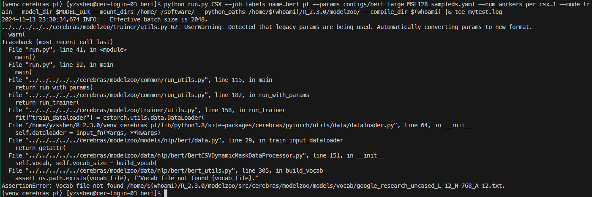
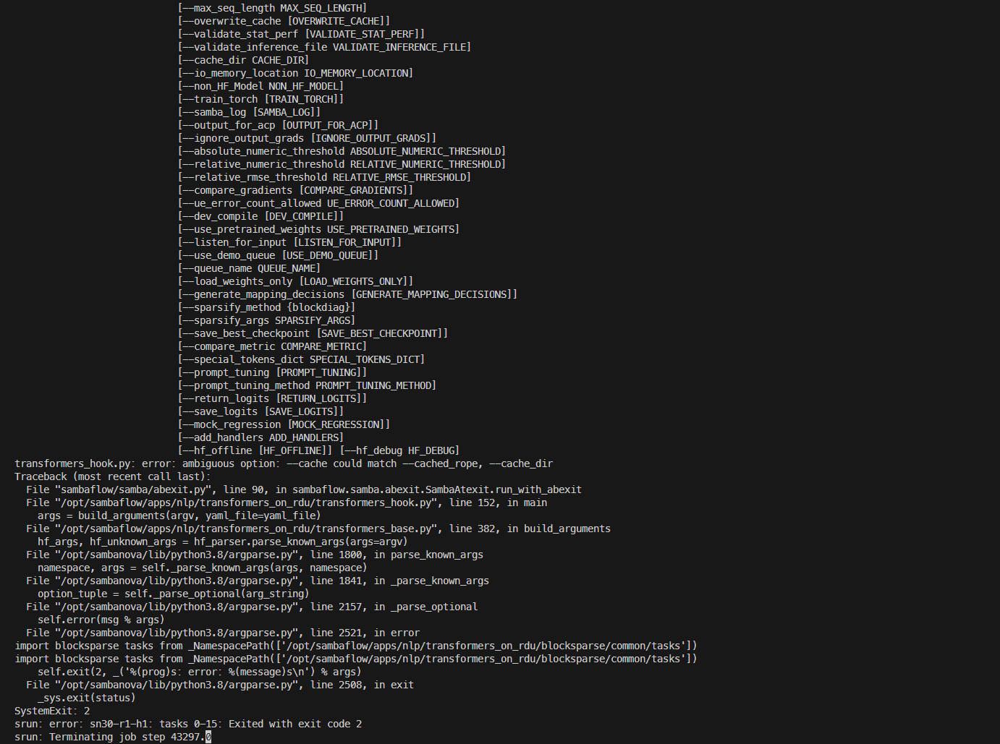

# Homework Submission

## Hands-on Homework

### Cerebras
<details>
<summary>Ran into an error with vocab:</summary>



</details>

### Sambanova
<details>
<summary>Ran into an error during training:</summary>



</details>

### Graphcore

- Increasing batchsize from 8 to 32 increased accuracy by 0.24.
- Increasing learning rate from 0.03 to 0.1 decreased accuracy by 0.28.
<details>
  <summary>lr=0.03, epochs=10, batch_size=8</summary>
  
  ```
  (poptorch33_env) yzsshen@gc-poplar-03:~$ history
    1  mkdir -p ~/venvs/graphcore
    2  virtualenv ~/venvs/graphcore/poptorch33_env
    3  source ~/venvs/graphcore/poptorch33_env/bin/activate
    4  POPLAR_SDK_ROOT=/software/graphcore/poplar_sdk/3.3.0
    5  export POPLAR_SDK_ROOT=$POPLAR_SDK_ROOT
    6  pip install $POPLAR_SDK_ROOT/poptorch-3.3.0+113432_960e9c294b_ubuntu_20_04-cp38-cp38-linux_x86_64.whl
    7  tmux
    8  history
(poptorch33_env) yzsshen@gc-poplar-03:~$ cd ~/graphcore/examples/tutorials/simple_applications/pytorch/mnist
(poptorch33_env) yzsshen@gc-poplar-03:~/graphcore/examples/tutorials/simple_applications/pytorch/mnist$ /opt/slurm/bin/srun --ipus=1 python mnist_poptorch.py
srun: job 27478 queued and waiting for resources
srun: job 27478 has been allocated resources
Epochs:   0%|          | 0/10 [00:00<?,[23:38:38.797] [poptorch:cpp] [warning] [DISPATCHER] Type coerced from Long to Int for tensor id 10
Graph compilation: 100%|██████████| 100/100 [00:20<00:00]
Epochs: 100%|██████████| 10/10 [01:47<00:00, 10.76s/it]
Graph compilation: 100%|██████████| 100/100 [00:14<00:00]                          
 95%|███████TrainingModelWithLoss(:00, 14.75it/s]<00:00]
  (model): Network(
    (layer1): Block(
      (conv): Conv2d(1, 32, kernel_size=(3, 3), stride=(1, 1))
      (pool): MaxPool2d(kernel_size=2, stride=2, padding=0, dilation=1, ceil_mode=False)
      (relu): ReLU()
    )
    (layer2): Block(
      (conv): Conv2d(32, 64, kernel_size=(3, 3), stride=(1, 1))
      (pool): MaxPool2d(kernel_size=2, stride=2, padding=0, dilation=1, ceil_mode=False)
      (relu): ReLU()
    )
    (layer3): Linear(in_features=1600, out_features=128, bias=True)
    (layer3_act): ReLU()
    (layer3_dropout): Dropout(p=0.5, inplace=False)
    (layer4): Linear(in_features=128, out_features=10, bias=True)
    (softmax): Softmax(dim=1)
  )
  (loss): CrossEntropyLoss()
)
Accuracy on test set: 98.15%
  ```
</details>

<details>
  <summary>lr=0.1, epochs=10, batch_size=8</summary>
  
  ```
(poptorch33_env) yzsshen@gc-poplar-03:~/graphcore/examples/tutorials/simple_applications/pytorch/mnist$ /opt/slurm/bin/srun --ipus=1 python mnist_poptorch.py
srun: job 27480 queued and waiting for resources
srun: job 27480 has been allocated resources
Epochs:   0%|          | 0/10 [00:00<?,[23:49:58.798] [poptorch:cpp] [warning] [DISPATCHER] Type coerced from Long to Int for tensor id 10
Graph compilation: 100%|██████████| 100/100 [00:20<00:00]
Epochs: 100%|██████████| 10/10 [01:46<00:00, 10.69s/it]
Graph compilation: 100%|██████████| 100/100 [00:14<00:00]                          
 95%|██████�TrainingModelWithLoss(:00, 14.65it/s]<00:00]
  (model): Network(
    (layer1): Block(
      (conv): Conv2d(1, 32, kernel_size=(3, 3), stride=(1, 1))
      (pool): MaxPool2d(kernel_size=2, stride=2, padding=0, dilation=1, ceil_mode=False)
      (relu): ReLU()
    )
    (layer2): Block(
      (conv): Conv2d(32, 64, kernel_size=(3, 3), stride=(1, 1))
      (pool): MaxPool2d(kernel_size=2, stride=2, padding=0, dilation=1, ceil_mode=False)
      (relu): ReLU()
    )
    (layer3): Linear(in_features=1600, out_features=128, bias=True)
    (layer3_act): ReLU()
    (layer3_dropout): Dropout(p=0.5, inplace=False)
    (layer4): Linear(in_features=128, out_features=10, bias=True)
    (softmax): Softmax(dim=1)
  )
  (loss): CrossEntropyLoss()
)
Accuracy on test set: 97.87%
  ```
</details>

<details>
  <summary>lr=0.03, epochs=10, batch_size=32</summary>
  
  ```
(poptorch33_env) yzsshen@gc-poplar-03:~/graphcore/examples/tutorials/simple_applications/pytorch/mnist$ /opt/slurm/bin/srun --ipus=1 python mnist_poptorch.py
srun: job 27481 queued and waiting for resources
srun: job 27481 has been allocated resources
Epochs:   0%|          | 0/10 [00:00<?,[23:54:27.088] [poptorch:cpp] [warning] [DISPATCHER] Type coerced from Long to Int for tensor id 10
Graph compilation: 100%|██████████| 100/100 [00:22<00:00]
Epochs: 100%|██████████| 10/10 [01:49<00:00, 10.96s/it]
Graph compilation: 100%|██████████| 100/100 [00:14<00:00]                          
 95%|███████TrainingModelWithLoss(:00, 14.33it/s]<00:00]
  (model): Network(
    (layer1): Block(
      (conv): Conv2d(1, 32, kernel_size=(3, 3), stride=(1, 1))
      (pool): MaxPool2d(kernel_size=2, stride=2, padding=0, dilation=1, ceil_mode=False)
      (relu): ReLU()
    )
    (layer2): Block(
      (conv): Conv2d(32, 64, kernel_size=(3, 3), stride=(1, 1))
      (pool): MaxPool2d(kernel_size=2, stride=2, padding=0, dilation=1, ceil_mode=False)
      (relu): ReLU()
    )
    (layer3): Linear(in_features=1600, out_features=128, bias=True)
    (layer3_act): ReLU()
    (layer3_dropout): Dropout(p=0.5, inplace=False)
    (layer4): Linear(in_features=128, out_features=10, bias=True)
    (softmax): Softmax(dim=1)
  )
  (loss): CrossEntropyLoss()
)
Accuracy on test set: 98.39%
  ```
</details>

<details>
  <summary>lr=0.1, epochs=10, batch_size=32</summary>
  
  Ran into an error with this one.

  ```
(poptorch33_env) yzsshen@gc-poplar-03:~/graphcore/examples/tutorials/simple_applications/pytorch/mnist$ /opt/slurm/bin/srun --ipus=1 python mnist_poptorch.py
srun: job 27483 queued and waiting for resources
srun: job 27483 has been allocated resources
Epochs:   0%|          | 0/10 [00:00<?,[00:01:08.575] [poptorch:cpp] [warning] [DISPATCHER] Type coerced from Long to Int for tensor id 10
Graph compilation: 100%|██████████| 100/100 [00:21<00:00]
Epochs:  40%|████      | 4/10 [00:58<01:40, 16.71s/it]                            /usr/lib/python3.8/threading.py:932: TqdmSynchronisationWarning: Set changed size during iteration (see https://github.com/tqdm/tqdm/issues/481)
  self.run() | Accuracy: 98.75% :  43%|████▎     | 64/150 [00:03<00:05, 16.16it/s] 
Epochs:  40%|████      | 4/10 [01:12<01:49, 18.21s/it]                            
TrainingModelWithLoss(
  (model): Network(
    (layer1): Block(
      (conv): Conv2d(1, 32, kernel_size=(3, 3), stride=(1, 1))
      (pool): MaxPool2d(kernel_size=2, stride=2, padding=0, dilation=1, ceil_mode=False)
      (relu): ReLU()
    )
    (layer2): Block(
      (conv): Conv2d(32, 64, kernel_size=(3, 3), stride=(1, 1))
      (pool): MaxPool2d(kernel_size=2, stride=2, padding=0, dilation=1, ceil_mode=False)
      (relu): ReLU()
    )
    (layer3): Linear(in_features=1600, out_features=128, bias=True)
    (layer3_act): ReLU()
    (layer3_dropout): Dropout(p=0.5, inplace=False)
    (layer4): Linear(in_features=128, out_features=10, bias=True)
    (softmax): Softmax(dim=1)
  )
  (loss): CrossEntropyLoss()
)
[00:02:21.356] [poptorch::python] [critical] poptorch.poptorch_core.UnrecoverableError: In unknown:0: 'poplar_unrecoverable_runtime_error': read_config_space(offset=0x3030): Could not complete operation. Fabric error: QP is not operational, device 1, IP 10.1.5.1:50054. IPUoF Server unreachable at 2024-11-14T00:02:21.345390Z
Error raised in:
  [0] execute


Traceback (most recent call last):
  File "mnist_poptorch.py", line 279, in <module>
    preds, losses = training_model(data, labels)
  File "/home/yzsshen/venvs/graphcore/poptorch33_env/lib/python3.8/site-packages/poptorch/_poplar_executor.py", line 1268, in __call__
    output = poptorch_core.execute(self._executable, in_tensors_flat)
poptorch.poptorch_core.UnrecoverableError: In unknown:0: 'poplar_unrecoverable_runtime_error': read_config_space(offset=0x3030): Could not complete operation. Fabric error: QP is not operational, device 1, IP 10.1.5.1:50054. IPUoF Server unreachable at 2024-11-14T00:02:21.345390Z
Error raised in:
  [0] execute


srun: error: gc-poplar-04: task 0: Exited with exit code 1
  ```
</details>

### Groq

<details>
  <summary>Could not get conda working</summary>
  
  ```bash
yzsshen@groq-r01-gn-01:~$ export PYTHON_VERSION=3.10.12
conda create -n groqflow python=$PYTHON_VERSION -y
conda activate groqflow
-bash: conda: command not found
-bash: conda: command not found
  ```
</details>